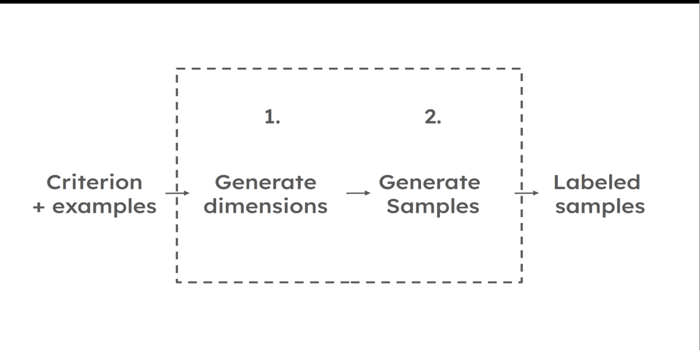
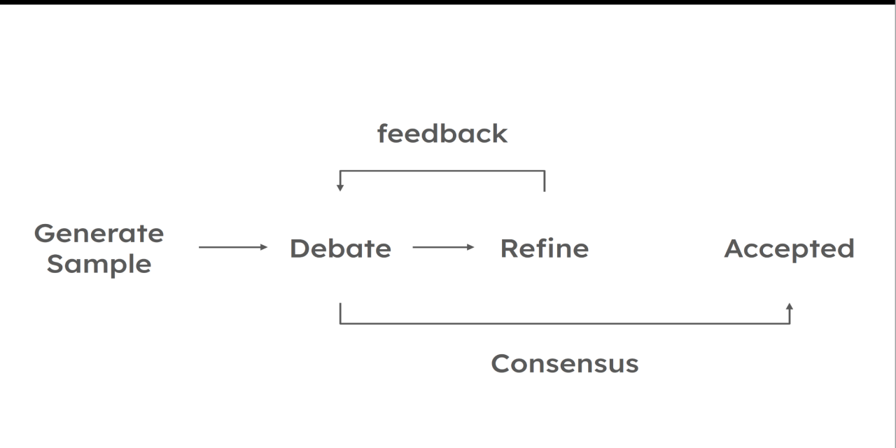

<p align="center">

</p>

# BARRED: generate faithful and diverse training sets

[](https://pypi.org/project/barred/)
[](https://pypi.org/project/barred/)
[](LICENSE)
[](https://arxiv.org/abs/2604.25203)

**Unofficial** implementation of the BARRED paper:

> Boundary Alignment Refinement through REflection and Debate, aka BARRED
> [arXiv:2604.25203](https://arxiv.org/pdf/2604.25203)

> [!NOTE]
> I developed this library for my own needs without endorsement. 
> It is not affiliated with the authors of the paper.

## What is BARRED?

In a nutshell: BARRED is a framework for generating **faithful** and **diverse** synthetic training data using only
a task description and a small set of unlabeled examples.

### Step by step



1. Define the task: a Criterion, plus a few examples of the kind of input you work on
    ```
    Criterion: True when the sentence expresses a positive sentiment, False otherwise

    Examples:
      - The delivery arrived two days late and the box was crushed.
      - Honestly one of the best purchases I've made this year.
      - It works, I guess.
    ```
2. Let the library decompose the problem into dimensions
3. Then the library generates the training set

Results: a set of **labeled** samples:
```
1. The screws stripped on the first turn, total waste.  -> False
2. Arrived a day early, and better than the photos.     -> True
3. Does the job. Nothing more to say.                   -> False   <- the gray zone
```

## Why is it cool?

Over the past few years, here's what kept happening to me:
- I developed a classifier but got no dataset (business people were busy)
- I asked for relevancy judgments on products, but got quite nothing
- I begged for annotated samples of search queries, but got none

So, BARRED is cool because it solves these problems by generating samples almost automatically.

And there is more. "Happy path" examples are easy to write. "Edge cases" are not, the gray zone, the "not true, not false".

Say you want to blacklist irrelevant products in search results (personal true story).
Anyone can tell that a hammer drill is relevant for a query on drills.
But what about drill bits? And a drill bit adapter? And a drill toy? And the dozen cases nobody thinks about?

That's where BARRED shines!

### How?

The naive way is to let an LLM generate samples straight from the problem description. **WRONG**!

LLMs forget parts of the problem. They don't "explore" much, they stick to their few default answers.

#### First smart idea of BARRED

The first thing that BARRED does is to decompose the problem into "Dimensions" and "Instantiations" of those dimensions. 

_I didn't know what an "instantiation" was (except in computing), but an `instantiation` is "concrete evidence in support of a concept/claim"._

Then, each instantiation will serve as a "seed" for the LLM to generate samples.

But can we generate samples directly from those instantiations right away? Of course not, that would be too simple!

#### Second smart idea of BARRED



BARRED makes 2 judges debate each sample until they agree.
When a judge disagrees, the sample is reworked using their feedback, then debated again, and so on. 

In the end, the generated samples can be accepted or not. This library only streams accepted samples, but you can also access the rejected ones using an `Observer`.

## Installation

```
uv add barred

# with Pip
pip install barred
```

This library builds on [any-llm from Mozilla AI](https://docs.mozilla.ai/any-llm/), and ships **no provider SDK by default**.  
You need the `any-llm-sdk` extra for the provider you want:

| Provider      | Install                                       |
|---------------|-----------------------------------------------|
| OpenAI        | `uv add barred "any-llm-sdk[openai]"`         |
| Anthropic     | `uv add barred "any-llm-sdk[anthropic]"`      |
| Gemini        | `uv add barred "any-llm-sdk[gemini]"`         |
| All providers | `uv add barred "any-llm-sdk[all]"`            |

See the [list of providers of any-llm](https://docs.mozilla.ai/providers).

Then set the matching key in your environment (`OPENAI_API_KEY`, `ANTHROPIC_API_KEY`, ...) or pass it to the `llm()` constructor.

## Show me some code

```python
import asyncio

from barred import LLM, barred, decompose_dimensions

#
# Step 1. Task definition
#
criterion = "True when the sentence expresses a positive sentiment, False otherwise"
examples = [
    "The delivery arrived two days late and the box was crushed.",
    "Honestly one of the best purchases I've made this year.",
    "It works, I guess.",
]


async def main():
    # Your provider, your model.
    # The key is read from the environment (OPENAI_API_KEY here), or with `api_key` param.
    llm = LLM(provider="openai", model="gpt-5.6-terra")

    #
    # Step 2. Decompose the Criterion into Dimensions
    #
    dimensions = await decompose_dimensions(llm, criterion=criterion, examples=examples)

    #
    # Step 3. Generate Samples, streamed as they land
    #
    async for sample in barred(
        llm,
        criterion=criterion,
        examples=examples,
        dimensions=dimensions,
        num_samples=5,
    ):
        print(sample.label, "->", sample.input_block)


asyncio.run(main())
```

## Notebook/Demo

> [!NOTE]
> The notebook is the best way to **see BARRED in action**.
>
> It includes: dimensions decomposition and the generation of samples.  
> You will also be able to give a grasp on the generated data
>
> [Open Notebook in GitHub](https://github.com/tomsquest/barred/blob/main/notebooks/demo_sentiment_analysis.ipynb)
> [Open Notebook in GoogleColab](https://colab.research.google.com/github/tomsquest/barred/blob/main/notebooks/demo_sentiment_analysis.ipynb)

## Authors and resources

Paper authors:
- [Arnon Mazza](https://www.linkedin.com/in/arnon-mazza-4471424/)
- [Elad Levi](https://www.linkedin.com/in/elad-levi-a938a3121/)

Company: [Plurai.ai](https://www.plurai.ai)

The main article giving a high-level overview of BARRED (April 28, 2026): [Introducing BARRED: turn any policy prompt into a high-accuracy efficient guardrail](https://www.plurai.ai/blog/introducing-barred-turn-any-policy-prompt-into-a-high-accuracy-efficient-guardrail)

> [!NOTE]
> I highly recommend giving Plurai.ai a shot to create a classifier. 
> Under the hood, the app uses (I think) a derived version of BARRED. 
> The UI and the experience are great.  
> [Try it out at plurai.ai](https://www.plurai.ai).

## Changelog/Releases

Changelog and releases are on [GitHub Releases](https://github.com/tomsquest/barred/releases).

## Development setup

Install after cloning the repository:

```bash
just install
```

Check everything (lint, type, tests...):

```bash
just checks
```

## Release

Releases are triggered by a version tag: pushing `v*` runs `.github/workflows/release.yml`,
which builds, smoke-tests the wheel and the sdist, then publishes to PyPI via Trusted
Publishing (no token involved).

`just release` recipe does the whole sequence — bump, check, commit, tag, push:

```bash
just release minor   # 0.2.0 => 0.3.0
just release patch   # 0.2.0 => 0.2.1
just release rc      # 0.2.0 => 0.2.0rc1, published as a pre-release
just release 1.0.0   # explicit version
```

It refuses to start from a dirty tree or outside `main`, and rolls the bump back if
anything fails, so a failed run leaves nothing behind.
